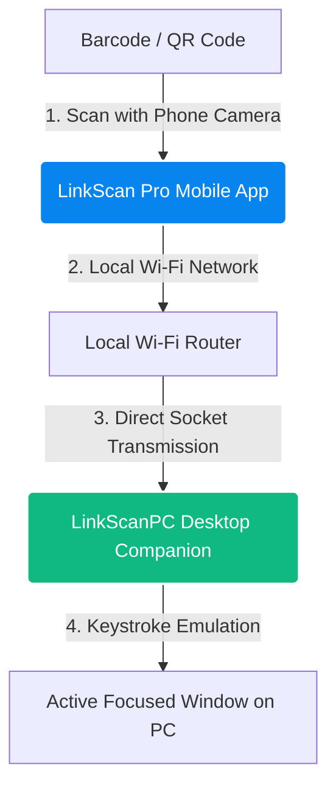

<p align="center">
  <a href="https://github.com/s4rrar/link-scan-web">
    
  </a>
</p>

<h1 align="center">LinkScan Web</h1>

<p align="center">
  The premium, high-performance, multilingual landing page for <a href="https://github.com/s4rrar/link-scan">LinkScan Pro</a> and the LinkScanPC companion.
</p>

<p align="center">
  <a href="https://github.com/s4rrar/link-scan-web/stargazers"></a>
  <a href="https://github.com/s4rrar/link-scan-web/network/members"></a>
  <a href="https://github.com/s4rrar/link-scan-web/blob/main/LICENSE"></a>
</p>

---

LinkScan Web is the modern landing page designed to present [LinkScan Pro](https://github.com/s4rrar/link-scan) and the **LinkScanPC** companion. The project showcase features glassmorphism design, advanced 3D hover/parallax cards, interactive background grids, fluid screen-transitions, and comprehensive RTL (Right-to-Left) localization support.

LinkScan Pro transforms any smartphone into a wireless barcode and QR code scanner for PCs. Scanned data is transmitted securely over the local network and typed directly into the active focused window on the computer—eliminating the need for expensive dedicated scanning hardware.

---

## <svg width="22" height="22" viewBox="0 0 24 24" fill="none" stroke="#0884ef" stroke-width="2.5" stroke-linecap="round" stroke-linejoin="round" style="vertical-align: middle; margin-right: 8px;"><path d="M4 12v8a2 2 0 0 0 2 2h12a2 2 0 0 0 2-2v-8"/><polyline points="16 6 12 2 8 6"/><line x1="12" y1="2" x2="12" y2="15"/></svg> How It Works

Below is the workflow showing how barcodes are scanned from your mobile device and instantly typed into your computer over the local network:



---

## <svg width="22" height="22" viewBox="0 0 24 24" fill="none" stroke="#0884ef" stroke-width="2.5" stroke-linecap="round" stroke-linejoin="round" style="vertical-align: middle; margin-right: 8px;"><polygon points="12 2 2 7 12 12 22 7 12 2"/><polyline points="2 17 12 22 22 17"/><polyline points="2 12 12 17 22 12"/></svg> Key Features

- **Wireless Scanning:** Use your smartphone camera as a wireless scanner to transmit barcode or QR code data to your computer in real time.
- **Automatic Keyboard Emulation:** Scanned codes are automatically typed into any active window on the desktop, such as spreadsheets, databases, inventory systems, or web applications.
- **Offline-First Scan History:** All scanned entries are saved locally using SQLite. History remains reviewable even without network access.
- **RTL Language Support:** Seamless multi-language configuration with full RTL support for Arabic and Hebrew languages.
- **Duplicate Scan Protection:** Configurable cooldown timer to prevent accidental consecutive scans of the same code.
- **Flashlight Integration:** Support for device flashlight to scan accurately in low-light warehouses, stockrooms, and shipping yards.
- **Cross-Platform PC Companion:** LinkScanPC is lightweight and runs on Windows, macOS, and Linux.

---

## <svg width="22" height="22" viewBox="0 0 24 24" fill="none" stroke="#0884ef" stroke-width="2.5" stroke-linecap="round" stroke-linejoin="round" style="vertical-align: middle; margin-right: 8px;"><circle cx="12" cy="12" r="10"/><line x1="2" y1="12" x2="22" y2="12"/><path d="M12 2a15.3 15.3 0 0 1 4 10 15.3 15.3 0 0 1-4 10 15.3 15.3 0 0 1-4-10 15.3 15.3 0 0 1 4-10z"/></svg> Internationalization (i18n)

LinkScan Web supports three major languages with responsive layout directions:

| Language | Code | Direction | Font Family |
|---|---|---|---|
| English | `en` | Left-to-Right (LTR) | Inter |
| Arabic | `ar` | Right-to-Left (RTL) | Tajawal |
| Hebrew | `he` | Right-to-Left (RTL) | Heebo |

Language selection is preserved across browser sessions using cookies and local storage to prevent flashes of unlocalized content during page load.

---

## <svg width="22" height="22" viewBox="0 0 24 24" fill="none" stroke="#0884ef" stroke-width="2.5" stroke-linecap="round" stroke-linejoin="round" style="vertical-align: middle; margin-right: 8px;"><polyline points="16 18 22 12 16 6"/><polyline points="8 6 2 12 8 18"/></svg> Tech Stack for Landing Page

- **Core Framework:** Next.js 16 (App Router)
- **Library:** React 19
- **Styling:** TailwindCSS 4 (using `@tailwindcss/postcss`)
- **Animation System:** Framer Motion 12 (3D parallax effects, scroll reveals, magnetic buttons, and page animations)
- **Localization System:** Custom React-context translation switcher supporting LTR/RTL switching

---

## <svg width="22" height="22" viewBox="0 0 24 24" fill="none" stroke="#0884ef" stroke-width="2.5" stroke-linecap="round" stroke-linejoin="round" style="vertical-align: middle; margin-right: 8px;"><polygon points="5 3 19 12 5 21 5 3"/></svg> Getting Started

### Prerequisites

Make sure you have Node.js (v18.x or later) and npm installed.

### Installation

1. Clone the repository:
   ```bash
   git clone https://github.com/s4rrar/link-scan-web.git
   ```

2. Navigate to the project root:
   ```bash
   cd link-scan-web
   ```

3. Install dependencies:
   ```bash
   npm install
   ```

### Running Locally

Start the local development server:
```bash
npm run dev
```

Open [http://localhost:3000](http://localhost:3000) in your browser to inspect the application.

### Building for Production

Compile the production build:
```bash
npm run build
```

Start the production server:
```bash
npm run start
```

---

## <svg width="22" height="22" viewBox="0 0 24 24" fill="none" stroke="#0884ef" stroke-width="2.5" stroke-linecap="round" stroke-linejoin="round" style="vertical-align: middle; margin-right: 8px;"><path d="M12 22s8-4 8-10V5l-8-3-8 3v7c0 6 8 10 8 10z"/></svg> Privacy & Security

LinkScan values your workflow security:
- **Zero Cloud Storage:** Scan history is stored entirely on the mobile device SQLite database.
- **Local Networks Only:** Scan packets are transmitted directly from your phone to your PC's IP address. No data is sent to external clouds or servers.
- **Auditability:** Fully open source codebase, making all communication channels visible and transparent.

---

## <svg width="22" height="22" viewBox="0 0 24 24" fill="none" stroke="#0884ef" stroke-width="2.5" stroke-linecap="round" stroke-linejoin="round" style="vertical-align: middle; margin-right: 8px;"><rect x="3" y="4" width="18" height="18" rx="2" ry="2"/><line x1="16" y1="2" x2="16" y2="6"/><line x1="8" y1="2" x2="8" y2="6"/><line x1="3" y1="10" x2="21" y2="10"/></svg> License

This project is licensed under the MIT License. See the [LICENSE](https://github.com/s4rrar/link-scan/blob/main/LICENSE) in the main app repository for details.
